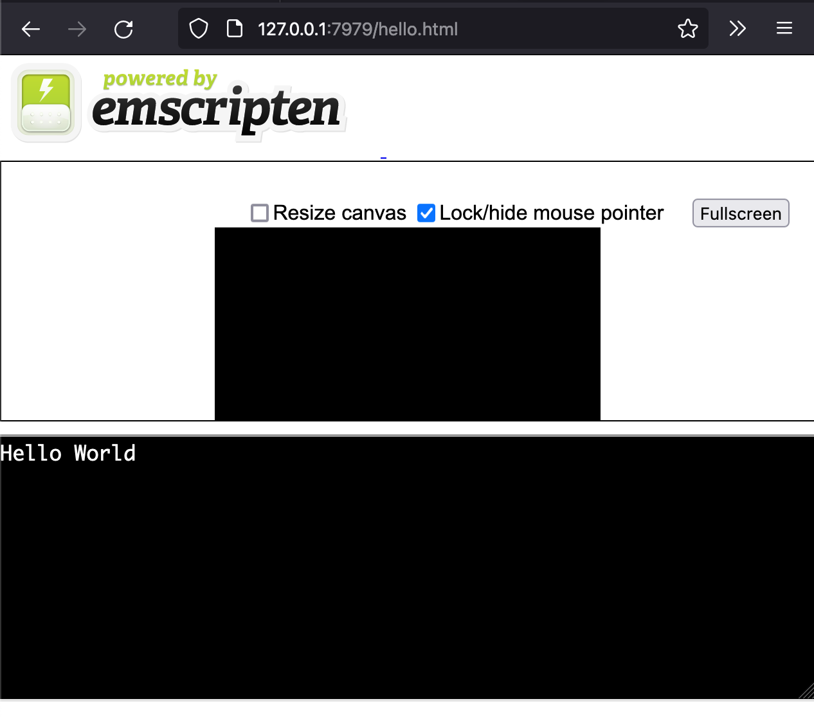
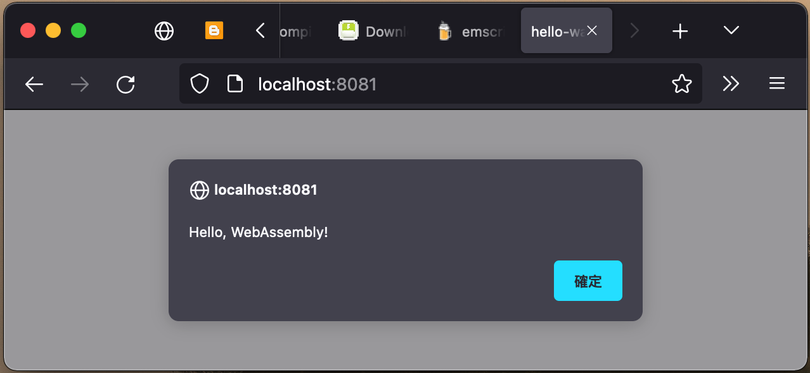

# web

## Details

1. WebAssembly

- https://developer.mozilla.org/en-US/docs/WebAssembly/C_to_wasm

- https://emscripten.org/

- https://emscripten.org/docs/getting_started/downloads.html

- https://developer.mozilla.org/en-US/docs/WebAssembly/Rust_to_wasm

- https://www.rust-lang.org/tools/install

## C & WebAssembly


完成 C 的環境，要先安裝 Emscripten ，在此為了方便使用 Brew 。

```
brew install emscripten
```

建立 hello.c (vim)

```
vim hello.c 
```

```
#include <stdio.h>

int main(int argc, char ** argv) {
  printf("Hello World\n");
}
```

進行 Emscripten compiler

```
emcc hello.c -s WASM=1 -o hello.html
```

對該 hello.html 用 Server 跑起來，在此用 PHP。

```
php -S 127.0.0.1:7979
```



## Rust & WebAssembly

完成 Rust 環境，安裝 wasm-pack

```
cargo install wasm-pack
```

註冊 NPM https://www.npmjs.com/signup

```
npm adduser
```

建立專案

```
cargo new --lib hello-wasm
```

hello-wasm/src/lib.rs

```
extern crate wasm_bindgen;

use wasm_bindgen::prelude::*;

#[wasm_bindgen]
extern {
    pub fn alert(s: &str);
}

#[wasm_bindgen]
pub fn greet(name: &str) {
    alert(&format!("Hello, {}!", name));
}
```

hello-wasm/Cargo.toml

```
[package]
name = "hello-wasm"
version = "0.1.0"
description = "A sample project with wasm-pack"
license = "MIT/Apache-2.0"
repository = "https://github.com/yourgithubusername/hello-wasm"

[lib]
crate-type = ["cdylib"]

[dependencies]
wasm-bindgen = "0.2"
```

Build wasm-pack

```
wasm-pack build --scope mynpmusername
```

將套件發佈到 NPM

```
cd pkg
npm publish --access=public
```

離開再建立 site

```
cd ../..
mkdir site
cd site
```

建立 package.json (`vim package.json`)

`@mynpmusername` 要改成 `@[帳號名稱]`

```
{
  "scripts": {
    "serve": "webpack-dev-server"
  },
  "dependencies": {
    "@mynpmusername/hello-wasm": "^0.1.0"
  },
  "devDependencies": {
    "webpack": "^4.25.1",
    "webpack-cli": "^3.1.2",
    "webpack-dev-server": "^3.1.10"
  }
}
```

建立 webpack.config.js (`vim webpack.config.js`)

```
const path = require('path');
module.exports = {
  entry: "./index.js",
  output: {
    path: path.resolve(__dirname, "dist"),
    filename: "index.js",
  },
  mode: "development"
};
```

建立 index.html (`vim index.html`)

```
<!DOCTYPE html>
<html>
  <head>
    <meta charset="utf-8">
    <title>hello-wasm example</title>
  </head>
  <body>
    <script src="./index.js"></script>
  </body>
</html>
```

建立 index.js (`vim index.js`)

```
const js = import("./node_modules/@yournpmusername/hello-wasm/hello_wasm.js");
js.then(js => {
  js.greet("WebAssembly");
});
```

建立與執行

```
npm install
npm run serve
```



