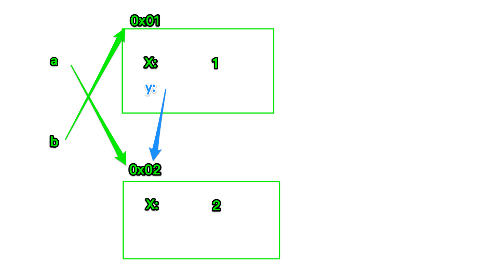

# web

- https://www.casper.tw/javascript/2018/01/01/javascript-eslint/

## Details

```
Hex School JS 課程 2022 核心
```

## Week 1

1.  為什麼要學核心知識

- 更熟 JavaScript 的運作

- 瞭解框架是怎麼運作的

- 面試中很常被問


2. 本週知識點：

- 作用域

- 提升

3. 習慣用的開發套件

- Live Server：https://marketplace.visualstudio.com/items?itemName=ritwickdey.LiveServer

4. 作用域

- 1. **沒有宣告變數會怎樣？變數及屬性的差異**

- window 下有什麼東西

- 宣告變數以及 window 的關係（var, let, const 均有所不同）

- 變數、屬性的差異（有沒有宣告變數會怎樣）

- 2. **變數作用域**

- 全域變數與區域變數

  - 全域變數：全國補助，EX:中央的補助，全台＋離島都可以申請。

  - 區域變數：縣市補助，EX:台北市的補助，新北市不能申請。

- var, let, const 作用域的差異

    - var 是屬於函式作用域

    - let, const 為 script, block

- 詞法作用域 → 變數作用域是什麼時候決定的？


5. 提升

為什麼需要把宣告放在前面

- 先定義與後定義的優缺點為何？
- 提升：為什麼函式陳述式宣告可以放在後面？
    - JavaScript 的記憶體運作概念 → 創造階段與執行階段
- let, const 的暫時性死區
- 補充：undefined 與 not defined 的差異

6. 本週小結

- var 特徵
    - 可以重複宣告
    - 會建立一個新屬性在 window 下
    - 作用域為 function scope
    - 具有提升現象
- let, const 特徵
    - 無法重複宣告
    - 不會建立一個新屬性在 window 下
    - 作用域為 script, block
    - 提升現象改為了暫時性死區

## Week 2 - 表達式、陳述式

```jsx
const person = {
  myName: '小明',
  fn() {
    return this.myName;
  }
}

console.log(person.fn());
console.log((person.fn = person.fn)());
console.log((person.fn || person.fn)());
```

1. 關於陳述式、表達式

- 什麼是表達式（也會有翻譯上的差異）

- 什麼是陳述式（兩者比較）

    - 更好的說明是陳述語句

- 補充：函式陳述式以及函式表達式的差異

    - 函式陳述式

    - 函式表達式

    - 具名函式與匿名函式

|  | 具名 | 可以塞在很多地方 
| --- | --- | --- |
| 函式表達式 | 非必要 | 可以 |
| 函式陳述式 | 必要 | 不行 |

2. 運算子

- 什麼是運算子 : https://developer.mozilla.org/zh-TW/docs/Web/JavaScript/Guide/Expressions_and_Operators

- 運算子的分類（一元、二元、三元）

- 先執行與後執行

- 所有的運算子，都是表達式

- 重點：**表達式可以運用的情境**


3. 補充：相依性與優先性

https://developer.mozilla.org/zh-TW/docs/Web/JavaScript/Reference/Operators/Operator_Precedence

- 程式碼的執行順序
- 實戰中，避免的寫法

## Week 3 - 型別轉換

1. JavaScript 的型別有哪些

- 原始型別

- 物件型別 與 原始型別 : https://developer.mozilla.org/zh-TW/docs/Web/JavaScript/Data_structures

- 型別判斷方法 : function

- 原始型別的方法來自於… 「原始型別包裹物件」

2. 的動態型別

- 型別變來變去？
- 型別轉換
    - 顯性
        - 原始型別包裹物件
        - 正負運算子
    - 隱性轉換
        - `+` 運算子
        - `+=` 運算子
        - 算術運算子

> 規則

3. **顯性轉換（單純）**

- 原始型別及包裹物件

依據原始型別或方法，轉換其結果

- 包裹物件
- 原型方法
- 數字型別的相關方法

4. 正負運算子 - 數值

注意：在此所指的是一元 + 運算子

關鍵！一定要先判斷是否為一元運算子

一元運算子所套用的是轉數值的型別方法

5. 邏輯 NOT 運算子（轉型為 boolean）

轉變為相反的布林值

6. 隱性轉換（複雜）

7. +運算子

- 規則一：前後運算元如果其中之一為 “字串” 型別，+ 視為字串運算子。

- 規則二：前後運算元如果無法轉型為原始型別（就是指物件型別），+ 視為字串運算子。

- 規則三：上述情況以外，+ 視為算數運算子。

8. 算術運算子

一律套用 Number 轉型

9. 型別轉換注意事項

BigInt 與 Number 型別無法混合計算

10. 型別比較

- 嚴格相等的規則

- 寬鬆相等

- 真值與假值

- 什麼是真假值：https://developer.mozilla.org/zh-CN/docs/Glossary/Truthy

- 攻略秘笈：https://dorey.github.io/JavaScript-Equality-Table/

11. 嚴格比較

需注意的例外狀況（如果真的不熟，可以背起來）

```html
false
console.log(NaN === NaN);
console.log(undefined === null);
console.log({} === {}); // 關於物件，會在後面的章節介紹
console.log([] === []);
console.log(new Number(0) === new Number(0));

true
console.log(+0 === -0);
```

12. 寬鬆相等

> Number, String, Boolean 這三者進行比對時 -> 通通都使用 Number 進行轉型

13. null, undefined

> 不轉型（都是 false），但 null 與 undefined 相比則是 true

14. BigInt（少考）

> 轉型為「數學值」，沒有 NaN、沒有小數點、沒有最大值
>
> 其它概念與 Number 接近

15. 物件與非物件比對

> 物件與其它型別比較時，會透過 “包裹物件” 將物件轉為相同型別

例外：

- 布林採用 Number 轉型

- 陣列轉數值，會先 toString 再套用 Number

16. 補充

- 真假值：https://developer.mozilla.org/zh-CN/docs/Glossary/Truthy

- 真假值表：https://dorey.github.io/JavaScript-Equality-Table/

## Week 4 - 物件與記憶體位置

讓你不要卡在物件的泥沼中

1. 基礎：更認識物件

- 物件的概念
- 物件定義與取值
    - 物件的屬性名稱一律是字串
    - 點記號 與 中括號 取值方式
- 如何避免物件取值錯誤
    - 進階語法，可選串連
- 陣列也是物件

2. 陣列方法：

- for 迴圈
- for 迴圈 vs forEach
- https://www.casper.tw/javascript/2017/12/27/javascript-array-function/

https://www.youtube.com/watch?v=_vFuDQ_6Xt8

3. 惡夢：物件傳參考

- 物件、變數的參考概念
    - 物件參考比較概念
- 函式、陣列也是參考嗎？
- 地獄考題：有機率遇到，但絕對不實用

```javascript
let a = { x: 1 }
let b = a;
a.y = a = { x: 2 };

console.log(a.y); // 這是什麼？
// 1 1
// 2 2
// 3 {x: 2}
// 4 undefined
```



- 如何完整複製物件

- let, const 在物件上的選用

4. 補充：

- 物件如何使用陣列方法

```javascript
const family = {
  Ming: {
    name: '小明',
  },
  Jay: {
    name: '杰倫'
  },
  Auntie: {
    name: '漂亮阿姨'
  }
};

console.log(Object.keys(family));
console.log(Object.values(family));

Object.values(family).forEach(item => {
  console.log(item);
});

Object.keys(family).forEach(key => {
  console.log(key);
  console.log(family[key]);
});
```

## Week 5

## Week 6

## Week 7

